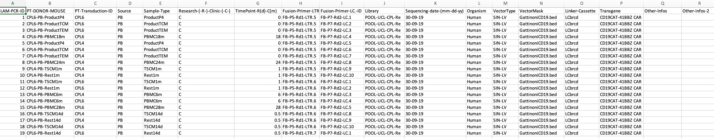
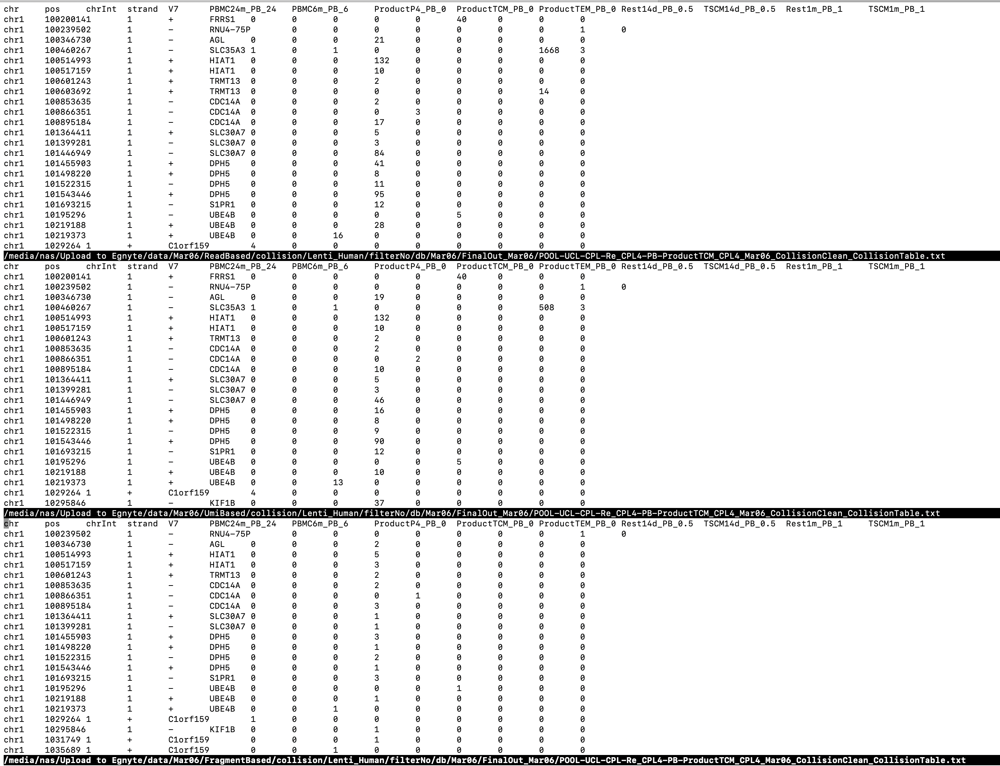

<!-- README.md is generated from README.Rmd. Please edit that file -->

```{r, include = FALSE}
knitr::opts_chunk$set(
  collapse = TRUE,
  comment = "#>"
)
```

# IS-Seq

<!-- badges: start -->
<!-- badges: end -->
IS-Seq is a pipeline for identifying insert sites on host genome when using viral vectors in gene therapy.

## Introduction

This pipeline can generate 3 types of analysis results based on different counting methods. These 3 types of resutls are ReadBased, Umibased, and FragmentBased analysis, respectively.

### To use IS-Seq in Linux workstation, you need to install the following software and modules
* Install conda and python 2.7.17

User needs to run IS-Seq under Python 2.7.17 environment. You can install Python 2.7.17 environment by downloading Miniconda2-latest-Linux-x86_64.sh from https://docs.conda.io/en/latest/miniconda.html, and install it by the following command:

```
bash Miniconda2-latest-Linux-x86_64.sh
```
* Other required software and managing python 2.7.17 and python3 environment

IS-Seq requiress to have the following software to be installed under Python 2.7.17 environment. User also needs to create an python3.7 environment, and install umi_tools under python3.7. IS-Seq will activate python3.7 to use umi_tools for UMI extracting automatically during running, User don't need to activate python3.7 manually

```{bash eval=FALSE, message=FALSE, warning=FALSE, results='hide'}
The list of tools and how to install it 

awk
Linux built-in, you do not need to install this

Python 2.7.17
python2

Tools can be installed by "conda install -c bioconda packageName" 

fastx_trimmer(conda install -c bioconda fastx_toolkit)
fastq_quality_trimmer(conda install -c bioconda fastx_toolkit)

blastn(conda install -c bioconda blastn)
seqtk(conda install -c bioconda seqtk)

fastq-multx(conda install -c bioconda -y ea-utils)
fastq-mcf(conda install -c bioconda -y ea-utils)(note: the earliest version of IS-Seq uses fastq-mcf for trimming LTR and LC, then uses flexbar to process *.skip.fq files. However, we find fastq-mcf trims one more nucleotide base, so the current version of IS-Seq uses cutadapt for trimming LTR and LC)

fastqutils(conda install -c bioconda ngsutils)

bwa(conda install -c bioconda bwa)
samtools(conda install -c bioconda samtools)
bedtools(conda install -c bioconda bedtools)
blat(conda install -c bioconda blat)
starcode(conda install -c bioconda starcode)

flexbar:
download flexbar-3.5.0-linux.tar.gz to somePath from https://github.com/seqan/flexbar/releases
then tar xvzf file.tar.gz from somePath,
and make a soft link:
ln -s somePath/flexbar-3.5.0-linux/flexbar /usr/bin/flexbar
e.g.
/usr/bin/flexbar -> /home/user/Downloads/flexbar-3.5.0-linux/flexbar
you also need "sudo apt-get install libtbb2" for flexbar to run

picard-tools:
sudo apt-get install picard-tools
use PicardCommandLine

R/Rscript(3.6.2)

cutadapt:
sudo apt install cutadapt

pip install numpy
pip install more_itertools

umi_tools:
conda create -n py3.7 python=3.7
pip install umi_tools
umi_tools is used for UMI extract, and run under python3.7 environment and this environment is activated at ad-hoc during running 

sudo apt-get install libxml2 libxml2-dev
sudo apt-get -y install libcurl4-gnutls-dev libxml2-dev libssl-dev

sudo apt-get install libcairo2-dev
sudo apt-get install libgtk2.0-dev xvfb xauth xfonts-base libxt-dev

if you want to run this Pipeline on AWS, you also need to do:
conda install Biopython


pip install more_itertools
sudo apt-get install libtbb2
conda install -c kantorlab blastn

```

* On R console:

```{r eval=FALSE, message=FALSE,warning=FALSE, results='hide'}

if (!requireNamespace("reshape", quietly = TRUE))
  install.packages("reshape",repos = "http://cran.us.r-project.org")

if (!requireNamespace("optparse", quietly = TRUE))
  install.packages("optparse",repos = "http://cran.us.r-project.org")

if (!requireNamespace("rmarkdown", quietly = TRUE))
  install.packages("rmarkdown",repos = "http://cran.us.r-project.org")

if (!requireNamespace("BiocManager", quietly = TRUE))
    install.packages("BiocManager")

BiocManager::install("GenomicRanges")

```

### To generate the reference genome data(mm10,hg19,hg38), you can run the following command:
```{bash eval=FALSE, message=FALSE, warning=FALSE, results='hide'}
# To have a quick look at how to generate
Rscript R/makeREFIndex.R -h

# For example: hg38
Rscript $HOME/user/IS-Seq/R/makeREFIndex.R -i ftp://ftp.ebi.ac.uk/pub/databases/gencode/Gencode_human/release_34/GRCh38.primary_assembly.genome.fa.gz -g ftp://ftp.ebi.ac.uk/pub/databases/gencode/Gencode_human/release_34/gencode.v34.annotation.gtf.gz -o /home/user/IS-Seq/utilsRefData/hg38/GRCh38.primary_assembly.genome.fa

```

### To get sequencing data from basespace, you can run the following command:
```{bash eval=FALSE, message=FALSE, warning=FALSE, results='hide'}

# if using basemount

conda deactivate
sudo apt install curl
sudo bash -c "$(curl -L https://basemount.basespace.illumina.com/install/)"
mkdir /media/BaseSpace

## mount 
basemount /media/BaseSpace
## unmount
basemount --unmount /media/BaseSpace

# unmount aws_share
sudo umount /media/aws_share

# mount again
sudo mount -a

## list run information firstly

bs run list

# if using bs download 
Download bs from https://developer.basespace.illumina.com/docs/content/documentation/cli/cli-overview firstly
 
bs download run -i 194449296 -o /Volumes/AvroLabData/BIASCO_Archive_Test_Folder/user_Temp_files/Basespace_runs/194449296

bs download run -i 194642476 -o /media/nas/BIASCO_Archive_Test_Folder/user_Temp_files/Basespace_runs/194642476 > logDownload.txt 2>&1 &

bs download run -i 194449296 -o /media/nas/BIASCO_Archive_Test_Folder/user_Temp_files/Basespace_runs/194449296 > logDownload_194449296.txt 2>&1 &


/media/nas/BIASCO_Archive_Test_Folder/user_Temp_files/Basespace_runs/194449296/Data/Intensities/BaseCalls:

#194642476

#195003845

#195844671

bs download run -i 195844671 -o /media/aws_share/D32_Platform_Development/1_Raw_Data/Basespace_Illumina_runs/MiSeq/Basespace_run_195844671


```

### Convert BCL files to fastq.gz files using bcl2fastq

```

# Example:

# 'ISA POOL AVRO 2'

nohup bcl2fastq --runfolder-dir /media/BaseSpace/Runs/'ISA POOL AVRO 2'/Files --output-dir /media/aws_share/D32_Platform_Development/test/02_Analyses/Sequencing_data_processing/MiSeq/Fastq_Illumina_runs/Basespace_run_198158076 > logOct25ToFq.txt 2>&1 &

```

### To have a quick start to using IS-Seq, you can run the following command:
```{bash eval=FALSE, message=FALSE, warning=FALSE, results='hide'}
python /home/user/IS-Seq/IS-SeqlineFv3_test.py

Usage: python /home/user/IS-Seq/IS-SeqlineFv3_test.py -1 <r1.fq.gz> -2 <r2.fq.gz> -s <sampleName> -o <outputFolder> -t <suffix> -r <researchFile> -u <referenceDataDir> -p <utilsProgramDir> -a <analysisType>
Example:
python /home/user/IS-Seq/IS-SeqlineFv3_test.py -1 /home/user/IS-Seq/data/PL0431_S1_L001_R1_001.fastq.gz -2 /home/user/IS-Seq/data/PL0431_S1_L001_R2_001.fastq.gz -s POOL-UCL-CPL-Re -o /home/user/UploadToEgnyte/user/ISseqOutput -t Mar04 -r /home/user/IS-Seq/sample_research/Association_pool_CPL_Nov19Fix.csv -u /home/user/IS-Seq/utilsRefData -p /home/user/IS-Seq/utils -a read

```

* Command line arguments:

  * -1 R1 read file for pair-ended sequencing files
  
  * -2 R2 read file for pair-ended sequencing files
  
  * -s sample name, e.g. "POOL-UCL-CPL-Re"  
  
  * -o The folder name of your output
  
  note: user should not use underscore(_) in the output folder name and file name because of special meanings of
  underscore(_) in Python
  
  * -t time you run this pipeline
  
  * -r association file. User should prepare an assocation file based on the formats in "association_pool_CPL_Nov19Fix.csv" in "sample_research" folder. you can check the detailed format information here {width=100%}. The following is the detailed information of each column in this format:
    
    * 1: LAM-PCR-ID	
    * 2: PT-DONOR-MOUSE	
    * 3: PT-Transduction-ID	
    * 4  Source	
    * 5: Sample-Type	
    * 6: Research-(-R-)-Clinic-(-C-)	
    * 7: TimePoint-R(d)-C(m) use month as measurement unit	
    * 8: Fusion-Primer-LTR.-ID	note: you shoud use give this like "FB-P5-Rd1-LTR.1",FB-P5-Rd1-LTR-1 will give an error  
    * 9: Fusion-Primer-LC.-ID	note: format requirement for LC barcode is like format requirement as LTR barcode
    * 10: Library, this is same as sample name in comand line arguments	
    * 11: Sequencing-date-(mm-dd-yy)	
    * 12: Organism	
    * 13: VectorType	
    * 14: VectorMask	
    * 15: Linker-Cassette	
    * 16: Transgene	
    * 17: Other-Infos	
    * 18: Other-infos-2
  
      note: user should not use underscore(_) in these column name and their entries in this table because of special meanings in Python
  
  * -u The folder you put reference data 
  
  * -p The folder for auxiliary scripts you need in IS-SeqlineFv3_test.py
  
  * -a analysis type, e.g. "read","missingIS","VectorCount","align2Vector","umi" or "fragment", 
  
  * -c the previous folder, this is a folder including those *grouped_IS file from previous run:
  
Note: you need to follow these order to run IS-Seq:

* You need to set up which genome will be used as reference genome in the association file Organism column, currently, the accepted genome is Human(hg19),hg38 and Mouse(mm10).

* You need to run ReadBased("-a read") firstly because the runs for "missingIS","VectorCount","umi" or "fragment" depends on the intermediate files from ReadBased.

* After you finished ReadBased run, if you want to get "missingIS", you just need to set '-a missingIS'.

* If you want to run '-a VectorCount', you need to finish '-a missingIS' firstly.

* align2Vector If you want to align all reads(not missing reads) on vector, use this analysis type

* To set the previous folder in -c, you need to follow the following rule:

  for example:
  
  You can find "*grouped_IS" files by using /home/user/Seagate/ISseqOutput/Oct22New/CutAdapt/filterNo/db/*grouped_IS
  
  The previous folder name you need to give is /home/user/Seagate/ISseqOutput/Oct22New
  
  
### To get ReadBased results, you need to run the following command:

```{bash eval=FALSE, message=FALSE, warning=FALSE, results='hide'}

nohup python -u $HOME/IS-Seq/IS-SeqlineFv3_test.py -1 $HOME/SHARE/D32_Platform_Development/test/02_Analyses/Sequencing_data_processing/MiSeq/Fastq_Illumina_runs/Basespace_run_194642476/Undetermined_S0_L001_R1_001.fastq.gz -2 $HOME/SHARE/D32_Platform_Development/test/02_Analyses/Sequencing_data_processing/MiSeq/Fastq_Illumina_runs/Basespace_run_194642476/Undetermined_S0_L001_R2_001.fastq.gz -s POOL-ISA-AVRO-TEST1 -o $HOME/ISseqOutput -t AVROTEST1 -r $HOME/SHARE/D32_Platform_Development/test/ISAtest/MiSeqTest/Association_pool_ISA_AVRO_TEST1_add_hg38.csv -u $HOME/SHARE/D32_Platform_Development/test/ISAtest/MiSeqTest/utilsRefData -p $HOME/IS-Seq/utils -a read -c nothing > logAVROTEST1.txt 2>&1 &

Rscript $HOME/user/IS-Seq/utils/getReadsFromSam.R -n 'pCDY.EFS.GlucoCco' -v /home/user/Seagate/ISseqOutput/Oct25/vector/align -a /media/aws_share/D32_Platform_Development/test/ISAtest/MiSeqTest/3_AssociationFIle_POOL_ISA_AVRO_2_GlucoCco_hg38.csv -o /home/user/Seagate/ISseqOutput/Oct25/total_vector_host_sam.rds

```


### To get UmiBased results, you need to run the following command:
```{bash eval=FALSE, message=FALSE, warning=FALSE, results='hide'}
nohup python -u $HOME/IS-Seq/IS-SeqlineFv3_test.py -1 $HOME/SHARE/D32_Platform_Development/test/02_Analyses/Sequencing_data_processing/MiSeq/Fastq_Illumina_runs/Basespace_run_194642476/Undetermined_S0_L001_R1_001.fastq.gz -2 $HOME/SHARE/D32_Platform_Development/test/02_Analyses/Sequencing_data_processing/MiSeq/Fastq_Illumina_runs/Basespace_run_194642476/Undetermined_S0_L001_R2_001.fastq.gz -s POOL-ISA-AVRO-TEST1 -o $HOME/ISseqOutput -t AVROTEST1 -r $HOME/SHARE/D32_Platform_Development/test/ISAtest/MiSeqTest/Association_pool_ISA_AVRO_TEST1_add_hg38.csv -u $HOME/SHARE/D32_Platform_Development/test/ISAtest/MiSeqTest/utilsRefData -p $HOME/IS-Seq/utils -a umi -c nothing > logAVROTEST1_umi.txt 2>&1 &

```

### To get FragmentBased results, you need to run the following command:
```{bash eval=FALSE, message=FALSE, warning=FALSE, results='hide'}
nohup python -u $HOME/IS-Seq/IS-SeqlineFv3_test.py -1 $HOME/SHARE/D32_Platform_Development/test/02_Analyses/Sequencing_data_processing/MiSeq/Fastq_Illumina_runs/Basespace_run_194642476/Undetermined_S0_L001_R1_001.fastq.gz -2 $HOME/SHARE/D32_Platform_Development/test/02_Analyses/Sequencing_data_processing/MiSeq/Fastq_Illumina_runs/Basespace_run_194642476/Undetermined_S0_L001_R2_001.fastq.gz -s POOL-ISA-AVRO-TEST1 -o $HOME/ISseqOutput -t AVROTEST1 -r $HOME/SHARE/D32_Platform_Development/test/ISAtest/MiSeqTest/Association_pool_ISA_AVRO_TEST1_add_hg38.csv -u $HOME/SHARE/D32_Platform_Development/test/ISAtest/MiSeqTest/utilsRefData -p $HOME/IS-Seq/utils -a fragment -c nothing > logAVROTEST1_fragment.txt 2>&1 &

```

Notes : For one sample of paired-end data with R1(2.4G) and R2(2.6G), you need to have 145G work space for read, umi and fragment based resutls totally.

The following Figure shows the differences on some insert sites among 3 methods 
{width=80%}


### To add new vector:
```{bash eval=FALSE, message=FALSE, warning=FALSE, results='hide'}
For example :
pCDY-EFS-hGLAco

do the following:
mkdir /home/user/IS-Seq/utilsRefData/vector/pCDY-EFS-hGLAco
add /home/user/IS-Seq/utilsRefData/vector/pCDY-EFS-hGLAco/pCDY-EFS-hGLAco_LTRtoLTR.fa
add /home/user/IS-Seq/utilsRefData/vector/pCDY-EFS-hGLAco/vector_genome_sorted.txt
add /home/user/IS-Seq/utilsRefData/vector/pCDY-EFS-hGLAco/vector_chr_list_num.txt

and make bwa index for this new vector:

bwa index -a bwtsw /home/user/IS-Seq/utilsRefData/vector/pCDY-EFS-hGLAco/pCDY-EFS-hGLAco_LTRtoLTR.fa

push 'add pCDY-EFS-hGLAco vector' Commit in IS-SeqlineFv3_test.py

and change vector name for the folowing run:
Rscript $HOME/user/IS-Seq/utils/getReadsFromSam.R -n 'pCDY-EFS-hGLAco_LTRtoLTR' -v /home/user/Seagate/ISseqOutput/Dec18/vector/align -a /media/aws_share/D32_Platform_Development/test/ISAtest/MiSeqTest/20201219_AssociationFIle_CLINICAL_ALL_user.csv -b 'POOL-ISA-AVRO-4' -o /home/user/Seagate/ISseqOutput/Dec18/total_vector_host_sam.rds

```

## A concise version of INSPIIRED

This code is implemented based on the idea of INSPIIRED. we re-used some codes from INSPIIRED. This concise version makes our analysis be more flexible. 

## Inputs
The following inputs are needed

```
Undetermined_S0_L001_I1_001.fastq.gz
Undetermined_S0_L001_R1_001.fastq.gz
Undetermined_S0_L001_R2_001.fastq.gz
``` 

## demultiplex
```bash
Rscript $HOME/IS-Seq/R/demultiplex.R $HOME/IS-Seq/testCases/intSiteValidation/Data/Undetermined_S0_L001_I1_001.fastq.gz $HOME/IS-Seq/testCases/intSiteValidation/completeMetadata.RData $HOME/IS-Seq/testCases/intSiteValidation/Data/Undetermined_S0_L001_R1_001.fastq.gz $HOME/IS-Seq/testCases/intSiteValidation/Data/Undetermined_S0_L001_R2_001.fastq.gz $HOME/SHARE/user/INSPIIRED_test
```

## Trim_After_Demultiplex
```bash
Rscript $HOME/R/IS-Seq/Trim_After_Demultiplex.R $HOME/IS-Seq/testCases/intSiteValidation/completeMetadata.RData $HOME/IS-Seq/MyTest/demultiplexedReps/clone1-1_R1.fastq.gz $HOME/IS-Seq/MyTest/demultiplexedReps/clone1-1_R2.fastq.gz $HOME/IS-Seq/testCases/intSiteValidation/p746vector.fasta $HOME/IS-Seq/testCases/intSiteValidation/hg18.2bit ~/SHARE/ISseqOutput/INSPIIRED_test_run
```

## call IS using blat-aligned R1 and R2 psl files
```bash
Rscript $HOME/IS-Seq/R/PslToIs_one_replicate_change_sequence_similarity.R $HOME/SHARE/ISseqOutput/Feb9G222/IsaByINSPIIRED/fa/HL60cl60HL60Poly100/R2_fastq_trim12nt_qcTrimmed_MatchBlastLtrLc_Barcode_FB-P7-Rd2-LC.20.fq_trimwithCutAdapt_HL60cl60HL60Poly100_ReadyToAlignSort.fa.psl $HOME/SHARE/ISseqOutput/Feb9G222/IsaByINSPIIRED/fa/HL60cl60HL60Poly100/R1_fastq_trim12nt_qcTrimmed_MatchBlastLtrLc_Barcode_FB-P5-Rd1-LTR.16.fq_trimwithCutAdapt_HL60cl60HL60Poly100_ReadyToAlignSort.fa.psl $HOME/SHARE/ISseqOutput/Feb9G222/IsaByINSPIIRED/fa/HL60cl60HL60Poly100/keys.rds ~/IS-Seq/testCases/intSiteValidation/completeMetadata.RData $HOME/SHARE/ISseqOutput/Feb9G222/IsaByINSPIIRED/fa/HL60cl60HL60Poly100/rev0 hg38 1 0
```

<!-- ## Update -->

<!-- IS-Seq use the "Latest" branch as the development branch, to update other branch, you need to use the following command: -->
<!-- ```{bash eval=FALSE, message=FALSE, warning=FALSE, results='hide'} -->
<!-- For example, to update the "Latest" branch: -->

<!-- git checkout Latest -->
<!-- git branch -a(To make sure you are in the Latest branch) -->
<!-- git pull -->

<!-- ``` -->

<!-- Usage: library(rmarkdown);rmarkdown::render("README.Rmd", output_format="all") --> 
<!-- render("README.Rmd", output_format = "word_document") -->
<!-- render("README.Rmd", output_format = "html_document") -->
<!-- library(rmarkdown);rmarkdown::render("README.Rmd", output_file='ISA_pipeline_readme.doc',output_dir='/Volumes/avrobio/Shared/D32_PlatformDevelopment_BIASCO/8_Tools/ISA_pipeline',output_format="word_document") -->
