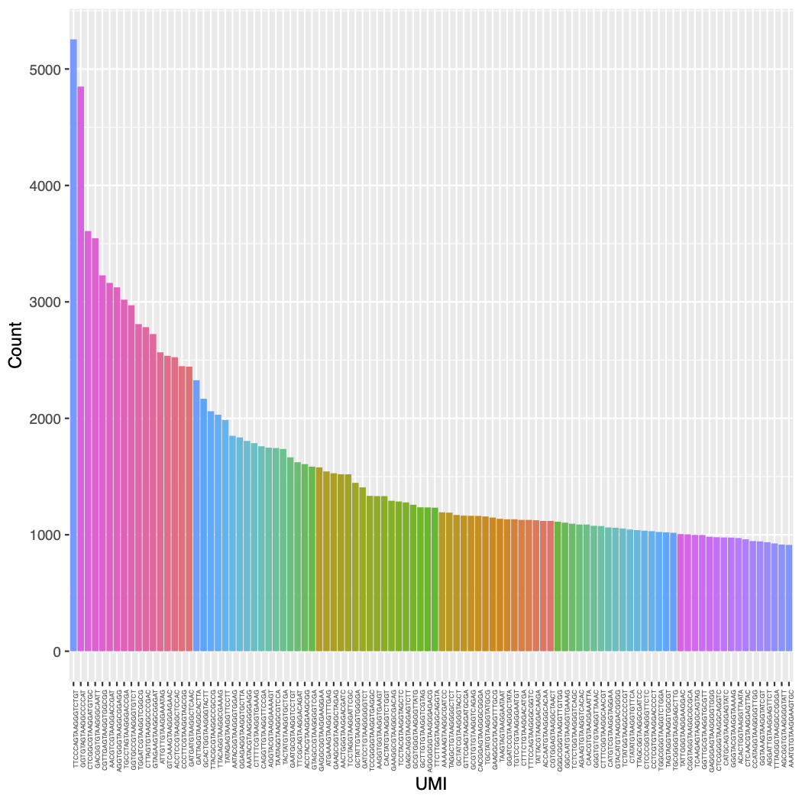
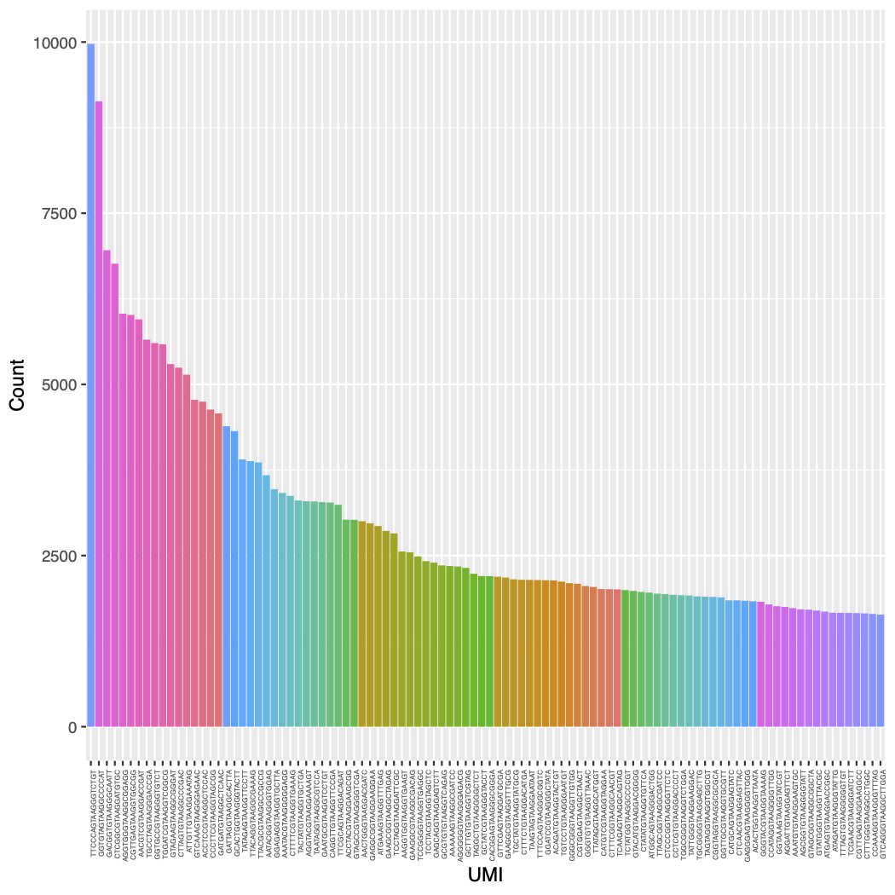

<!-- README.md is generated from README.Rmd. Please edit that file -->

# IS-Seq

<!-- badges: start -->

<!-- badges: end -->

IS-Seq is a pipeline for identifying insert sites on host genome when
using viral vectors in gene therapy.

## Introduction

This pipeline can generate 3 types of analysis results based on
different counting methods. These 3 types of resutls are ReadBased,
Umibased, and FragmentBased analysis,
respectively.

### To use IS-Seq in Linux workstation, you need to install the following software and modules

  - Install conda and python 2.7.17

User needs to run IS-Seq under Python 2.7.17 environment. You can
install Python 2.7.17 environment by downloading
Miniconda2-latest-Linux-x86\_64.sh from
<https://docs.conda.io/en/latest/miniconda.html>, and install it by the
following command:

    bash Miniconda2-latest-Linux-x86_64.sh

  - Other required software and managing python 2.7.17 and python3
    environment

IS-Seq requiress to have the following software to be installed under
Python 2.7.17 environment. User also needs to create an python3.7
environment, and install umi\_tools under python3.7. IS-Seq will
activate python3.7 to use umi\_tools for UMI extracting automatically
during running, User don’t need to activate python3.7 manually

``` bash
The list of tools and how to install it 

awk
Linux built-in, you do not need to install this

Python 2.7.17
python2

Tools can be installed by "conda install -c bioconda packageName" 

fastx_trimmer(conda install -c bioconda fastx_toolkit)
fastq_quality_trimmer(conda install -c bioconda fastx_toolkit)

blastn(conda install -c bioconda blastn)
seqtk(conda install -c bioconda seqtk)

fastq-multx(conda install -c bioconda -y ea-utils)
fastq-mcf(conda install -c bioconda -y ea-utils)(note: the earliest version of IS-Seq uses fastq-mcf for trimming LTR and LC, then uses flexbar to process *.skip.fq files. However, we find fastq-mcf trims one more nucleotide base, so the current version of IS-Seq uses cutadapt for trimming LTR and LC)

fastqutils(conda install -c bioconda ngsutils)

bwa(conda install -c bioconda bwa)
samtools(conda install -c bioconda samtools)
bedtools(conda install -c bioconda bedtools)
blat(conda install -c bioconda blat)
starcode(conda install -c bioconda starcode)

flexbar:
download flexbar-3.5.0-linux.tar.gz to somePath from https://github.com/seqan/flexbar/releases
then tar xvzf file.tar.gz from somePath,
and make a soft link:
ln -s somePath/flexbar-3.5.0-linux/flexbar /usr/bin/flexbar
e.g.
/usr/bin/flexbar -> /home/user/Downloads/flexbar-3.5.0-linux/flexbar
you also need "sudo apt-get install libtbb2" for flexbar to run

picard-tools:
sudo apt-get install picard-tools
use PicardCommandLine

R/Rscript(3.6.2)

cutadapt:
sudo apt install cutadapt

pip install numpy
pip install more_itertools

umi_tools:
conda create -n py3.7 python=3.7
pip install umi_tools
umi_tools is used for UMI extract, and run under python3.7 environment and this environment is activated at ad-hoc during running 

sudo apt-get install libxml2 libxml2-dev
sudo apt-get -y install libcurl4-gnutls-dev libxml2-dev libssl-dev

sudo apt-get install libcairo2-dev
sudo apt-get install libgtk2.0-dev xvfb xauth xfonts-base libxt-dev

if you want to run this Pipeline on AWS, you also need to do:
conda install Biopython
```

  - On R console:

<!-- end list -->

``` r

if (!requireNamespace("reshape", quietly = TRUE))
  install.packages("reshape",repos = "http://cran.us.r-project.org")

if (!requireNamespace("optparse", quietly = TRUE))
  install.packages("optparse",repos = "http://cran.us.r-project.org")

if (!requireNamespace("rmarkdown", quietly = TRUE))
  install.packages("rmarkdown",repos = "http://cran.us.r-project.org")

if (!requireNamespace("BiocManager", quietly = TRUE))
    install.packages("BiocManager")

BiocManager::install("GenomicRanges")
```

### To generate the reference genome data(mm10,hg19,hg38), you can run the following command:

``` bash
# To have a quick look at how to generate
Rscript R/makeREFIndex.R -h

# For example: hg38
Rscript $HOME/user/IS-Seq/R/makeREFIndex.R -i ftp://ftp.ebi.ac.uk/pub/databases/gencode/Gencode_human/release_34/GRCh38.primary_assembly.genome.fa.gz -g ftp://ftp.ebi.ac.uk/pub/databases/gencode/Gencode_human/release_34/gencode.v34.annotation.gtf.gz -o /home/user/IS-Seq/utilsRefData/hg38/GRCh38.primary_assembly.genome.fa
```

### To get sequencing data from basespace, you can run the following command:

``` bash

# if using basemount

conda deactivate
sudo apt install curl
sudo bash -c "$(curl -L https://basemount.basespace.illumina.com/install/)"
mkdir /media/BaseSpace

## mount 
basemount /media/BaseSpace/
## unmount
basemount --unmount /media/BaseSpace

# unmount aws_share
sudo umount /media/aws_share

# mount again
sudo mount -a

## list run information firstly

bs run list

# if using bs download 
Download bs from https://developer.basespace.illumina.com/docs/content/documentation/cli/cli-overview firstly
 
bs download run -i 194449296 -o /Volumes/AvroLabData/BIASCO_Archive_Test_Folder/user_Temp_files/Basespace_runs/194449296

bs download run -i 194642476 -o /media/nas/BIASCO_Archive_Test_Folder/user_Temp_files/Basespace_runs/194642476 > logDownload.txt 2>&1 &

bs download run -i 194449296 -o /media/nas/BIASCO_Archive_Test_Folder/user_Temp_files/Basespace_runs/194449296 > logDownload_194449296.txt 2>&1 &


/media/nas/BIASCO_Archive_Test_Folder/user_Temp_files/Basespace_runs/194449296/Data/Intensities/BaseCalls:

#194642476

#195003845

#195844671

bs download run -i 195844671 -o /media/aws_share/D32_Platform_Development/1_Raw_Data/Basespace_Illumina_runs/MiSeq/Basespace_run_195844671
```

### Convert BCL files to fastq.gz files using bcl2fastq

    cd /media/nas/BIASCO_Archive_Test_Folder/Basespace_Illumina_runs/Basespace_run_194642476
    
    bcl2fastq 
    
    You will find *.fastq.gz files under this following folder /media/nas/BIASCO_Archive_Test_Folder/Basespace_Illumina_runs/Basespace_run_194642476/Data/Intensities/BaseCalls/
    
    
    bcl2fastq --runfolder-dir /media/BaseSpace/Runs/Pool\ ISA\ AVRO\ Test1_Run2/Files --output-dir ~/user/Seagate/Pool_ISA_AVRO_Test1_Run2
    
    # To get 'Pool ISA AVRO Test2' data,  unmount /media/BaseSpace, then mount again by the following command:
    
    basemount --unmount /media/BaseSpace
    basemount /media/BaseSpace
    
    then
    
    bcl2fastq --runfolder-dir /media/BaseSpace/Runs/Pool\ ISA\ AVRO\ Test2/Files --output-dir ~/user/Seagate/Pool_ISA_AVRO_Test2
    
    # Pool-ISA-AVROtest3, note : ~/user/Seagate/Basespace_run_196467313 will be created automaticaly.
    
    bcl2fastq --runfolder-dir /media/aws_share/D32_Platform_Development/test/01_RawData/Basespace_Illumina_runs/MiSeq/Basespace_run_196467313 --output-dir ~/user/Seagate/Basespace_run_196467318
    
    # POOL ISA AVRO Test4,
    nohup bcl2fastq --runfolder-dir /media/BaseSpace/Runs/'POOL ISA AVRO Test4'/Files --output-dir /media/aws_share/D32_Platform_Development/test/02_Analyses/Sequencing_data_processing/MiSeq/Fastq_Illumina_runs/Basespace_run_197070906 > logSept2ToFq.txt 2>&1 &
    
    # 'ISA POOL AVRO 1'
    
    nohup bcl2fastq --runfolder-dir /media/BaseSpace/Runs/'ISA POOL AVRO 1'/Files --output-dir /media/aws_share/D32_Platform_Development/test/02_Analyses/Sequencing_data_processing/MiSeq/Fastq_Illumina_runs/Basespace_run_197984856 > logOct22ToFq.txt 2>&1 &
    
    
    # 'ISA POOL AVRO 2'
    
    nohup bcl2fastq --runfolder-dir /media/BaseSpace/Runs/'ISA POOL AVRO 2'/Files --output-dir /media/aws_share/D32_Platform_Development/test/02_Analyses/Sequencing_data_processing/MiSeq/Fastq_Illumina_runs/Basespace_run_198158076 > logOct25ToFq.txt 2>&1 &

### To have a quick start to using IS-Seq, you can run the following command:

``` bash
python /home/user/IS-Seq/IS-SeqlineFv3_test.py

Usage: python /home/user/IS-Seq/IS-SeqlineFv3_test.py -1 <r1.fq.gz> -2 <r2.fq.gz> -s <sampleName> -o <outputFolder> -t <suffix> -r <researchFile> -u <referenceDataDir> -p <utilsProgramDir> -a <analysisType>
Example:
python /home/user/IS-Seq/IS-SeqlineFv3_test.py -1 /home/user/IS-Seq/data/PL0431_S1_L001_R1_001.fastq.gz -2 /home/user/IS-Seq/data/PL0431_S1_L001_R2_001.fastq.gz -s POOL-UCL-CPL-Re -o /home/user/UploadToEgnyte/user/ISseqOutput -t Mar04 -r /home/user/IS-Seq/sample_research/Association_pool_CPL_Nov19Fix.csv -u /home/user/IS-Seq/utilsRefData -p /home/user/IS-Seq/utils -a read
```

  - Command line arguments:
    
      - \-1 R1 read file for pair-ended sequencing files
    
      - \-2 R2 read file for pair-ended sequencing files
    
      - \-s sample name, e.g. “POOL-UCL-CPL-Re”
    
      - \-o The folder name of your output
    
    note: user should not use underscore(*) in the output folder name
    and file name because of special meanings of underscore(*) in Python
    
      - \-t time you run this pipeline
    
      - \-r association file. User should prepare an assocation file
        based on the formats in “association\_pool\_CPL\_Nov19Fix.csv”
        in “sample\_research” folder. you can check the detailed format
        information here
        . The
        following is the detailed information of each column in this
        format:
        
          - 1: LAM-PCR-ID
        
          - 2: PT-DONOR-MOUSE
        
          - 3: PT-Transduction-ID
        
          - 4 Source
        
          - 5: Sample-Type  
        
          - 6: Research-(-R-)-Clinic-(-C-)  
        
          - 7: TimePoint-R(d)-C(m) use month as measurement unit  
        
          - 8: Fusion-Primer-LTR.-ID note: you shoud use give this like
            “FB-P5-Rd1-LTR.1”,FB-P5-Rd1-LTR-1 will give an error  
        
          - 9: Fusion-Primer-LC.-ID note: format requirement for LC
            barcode is like format requirement as LTR barcode
        
          - 10: Library, this is same as sample name in comand line
            arguments
        
          - 11: Sequencing-date-(mm-dd-yy)  
        
          - 12: Organism  
        
          - 13: VectorType  
        
          - 14: VectorMask  
        
          - 15: Linker-Cassette  
        
          - 16: Transgene
        
          - 17: Other-Infos  
        
          - 18: Other-infos-2
            
            note: user should not use underscore(\_) in these column
            name and their entries in this table because of special
            meanings in Python
    
      - \-u The folder you put reference data
    
      - \-p The folder for auxiliary scripts you need in
        IS-SeqlineFv3\_test.py
    
      - \-a analysis type, e.g.
        “read”,“missingIS”,“VectorCount”,“align2Vector”,“umi”
        or “fragment”,
    
      - \-c the previous folder, this is a folder including those
        \*grouped\_IS file from previous run:

Note: you need to follow these order to run IS-Seq:

  - You need to set up which genome will be used as reference genome in
    the association file Organism column, currently, the accepted genome
    is Human(hg19),hg38 and Mouse(mm10).

  - You need to run ReadBased(“-a read”) firstly because the runs for
    “missingIS”,“VectorCount”,“umi” or “fragment” depends on the
    intermediate files from ReadBased.

  - After you finished ReadBased run, if you want to get “missingIS”,
    you just need to set ‘-a missingIS’.

  - If you want to run ‘-a VectorCount’, you need to finish ‘-a
    missingIS’ firstly.

  - align2Vector If you want to align all reads(not missing reads) on
    vector, use this analysis type

  - To set the previous folder in -c, you need to follow the following
    rule:
    
    for example:
    
    You can find "*grouped\_IS" files by using
    /home/user/Seagate/ISseqOutput/Oct22New/CutAdapt/filterNo/db/*grouped\_IS
    
    The previous folder name you need to give is
    /home/user/Seagate/ISseqOutput/Oct22New

### To get ReadBased results, you need to run the following command:

``` bash
nohup python -u /home/user/IS-Seq/IS-SeqlineFv3_test.py -1 /home/user/IS-Seq/data/PL0431_S1_L001_R1_001.fastq.gz -2 /home/user/IS-Seq/data/PL0431_S1_L001_R2_001.fastq.gz -s POOL-UCL-CPL-Re -o /home/user/IS-Seq/ISseqOutput -t Mar06 -r /home/user/IS-Seq/sample_research/Association_pool_CPL_Nov19Fix.csv -u /home/user/IS-Seq/utilsRefData -p /home/user/IS-Seq/utils -a read > logMar06.txt 2>&1 &

# TEST1
# If you want to output resutls to local Linux:
nohup python -u /home/user/IS-Seq/IS-SeqlineFv3_test.py -1 /media/nas/BIASCO_Archive_Test_Folder/Basespace_Illumina_runs/Basespace_run_194642476/Data/Intensities/BaseCalls/Undetermined_S0_L001_R1_001.fastq.gz -2 /media/nas/BIASCO_Archive_Test_Folder/Basespace_Illumina_runs/Basespace_run_194642476/Data/Intensities/BaseCalls/Undetermined_S0_L001_R2_001.fastq.gz -s POOL-ISA-AVRO-TEST1 -o /home/user/IS-Seq/ISseqOutput -t Apr13 -r /media/nas/MiSeqTest/Association_pool_ISA_AVRO_TEST1_add.csv -u /home/user/IS-Seq/utilsRefData -p /home/user/IS-Seq/utils -a read > logApr13.txt 2>&1 &

# If you want to output results to NAS directly:(this takes longer time since NAS connection issue)
nohup python -u /home/user/IS-Seq/IS-SeqlineFv3_test.py -1 /media/nas/BIASCO_Archive_Test_Folder/Basespace_Illumina_runs/Basespace_run_194642476/Data/Intensities/BaseCalls/Undetermined_S0_L001_R1_001.fastq.gz -2 /media/nas/BIASCO_Archive_Test_Folder/Basespace_Illumina_runs/Basespace_run_194642476/Data/Intensities/BaseCalls/Undetermined_S0_L001_R2_001.fastq.gz -s POOL-ISA-AVRO-TEST1 -o /home/user/UploadToEgnyte/user/ISseqOutput -t Apr13 -r /media/nas/MiSeqTest/Association_pool_ISA_AVRO_TEST1_add.csv -u /home/user/IS-Seq/utilsRefData -p /home/user/IS-Seq/utils -a read > logApr13.txt 2>&1 &

# TEST1_Run2 
nohup python -u /home/user/IS-Seq/IS-SeqlineFv3_test.py -1 /home/user/Seagate/Pool_ISA_AVRO_Test1_Run2/Pool_ISA_Avro_Test1_S1_L001_R1_001.fastq.gz -2 /home/user/Seagate/Pool_ISA_AVRO_Test1_Run2/Pool_ISA_Avro_Test1_S1_L001_R2_001.fastq.gz -s POOL-ISA-AVRO-TEST1 -o /home/user/Seagate/ISseqOutput -t May1 -r /media/nas/MiSeqTest/Association_pool_ISA_AVRO_TEST1_add.csv -u /home/user/IS-Seq/utilsRefData -p /home/user/IS-Seq/utils -a read > logMay1.txt 2>&1 &

# TEST2
nohup python -u /home/user/IS-Seq/IS-SeqlineFv3_test.py -1 /home/user/Seagate/Pool_ISA_AVRO_Test2/EXP39_ISA_pool_2_S1_L001_R1_001.fastq.gz -2 /home/user/Seagate/Pool_ISA_AVRO_Test2/EXP39_ISA_pool_2_S1_L001_R2_001.fastq.gz -s POOL-ISA-AVRO-TEST2 -o /home/user/Seagate/ISseqOutput -t June24 -r /media/nas/MiSeqTest/Association_pool_ISA_AVRO_TEST2_add_CB.csv -u /home/user/IS-Seq/utilsRefData -p /home/user/IS-Seq/utils -a read > logJune24.txt 2>&1 &

nohup python -u /home/user/IS-Seq/IS-SeqlineFv3_test.py -1 /home/user/Seagate/Pool_ISA_AVRO_Test2/EXP39_ISA_pool_2_S1_L001_R1_001.fastq.gz -2 /home/user/Seagate/Pool_ISA_AVRO_Test2/EXP39_ISA_pool_2_S1_L001_R2_001.fastq.gz -s POOL-ISA-AVRO-TEST2 -o /home/user/Seagate/ISseqOutput -t June24 -r /media/nas/MiSeqTest/Association_pool_ISA_AVRO_TEST2_add_CB.csv -u /home/user/IS-Seq/utilsRefData -p /home/user/IS-Seq/utils -a read > logJune24-4.txt 2>&1 &

# test hg38

nohup python -u /home/user/IS-Seq/IS-SeqlineFv3_test.py -1 /home/user/Seagate/Pool_ISA_AVRO_Test1_Run2/Pool_ISA_Avro_Test1_S1_L001_R1_001.fastq.gz -2 /home/user/Seagate/Pool_ISA_AVRO_Test1_Run2/Pool_ISA_Avro_Test1_S1_L001_R2_001.fastq.gz -s POOL-ISA-AVRO-TEST1 -o /home/user/Seagate/ISseqOutput -t July24 -r /media/nas/MiSeqTest/Association_pool_ISA_AVRO_TEST1_add_hg38.csv -u /home/user/IS-Seq/utilsRefData -p /home/user/IS-Seq/utils -a read > logJuly24.txt 2>&1 &

# test POOL-ISA-AVRO-TEST3
nohup python -u /home/user/IS-Seq/IS-SeqlineFv3_test.py -1 /home/user/Seagate/Basespace_run_196467313/Pool-ISA-AVROtest3_S1_L001_R1_001.fastq.gz -2 /home/user/Seagate/Basespace_run_196467313/Pool-ISA-AVROtest3_S1_L001_R2_001.fastq.gz -s POOL-ISA-AVRO-TEST3 -o /home/user/Seagate/ISseqOutput -t July27 -r /media/nas/MiSeqTest/Association_pool_ISA_AVRO_TEST3.csv -u /home/user/IS-Seq/utilsRefData -p /home/user/IS-Seq/utils -a read > logJuly27.txt 2>&1 &

# test POOL ISA AVRO Test4 for missingIS on hg38(note: you need run -a read analysis firstly)
nohup python -u /home/user/IS-Seq/IS-SeqlineFv3_test.py -1 /media/aws_share/D32_Platform_Development/test/02_Analyses/Sequencing_data_processing/MiSeq/Fastq_Illumina_runs/Basespace_run_197070906/POOL_ISA_AVRO_Test4_S1_L001_R1_001.fastq.gz -2 /media/aws_share/D32_Platform_Development/test/02_Analyses/Sequencing_data_processing/MiSeq/Fastq_Illumina_runs/Basespace_run_197070906/POOL_ISA_AVRO_Test4_S1_L001_R2_001.fastq.gz -s POOL-ISA-AVRO-TEST4 -o /home/user/Seagate/ISseqOutput -t Sept2 -r /media/aws_share/D32_Platform_Development/test/ISAtest/MiSeqTest/Association_pool_ISA_AVRO_TEST4_add.csv -u /home/user/IS-Seq/utilsRefData -p /home/user/IS-Seq/utils -a missingIS > logSept2MissingIS.txt 2>&1 &

# test POOL ISA AVRO Test4 for missingIS on hg19(note: you need run -a read analysis firstly)
nohup python -u /home/user/IS-Seq/IS-SeqlineFv3_test.py -1 /media/aws_share/D32_Platform_Development/test/02_Analyses/Sequencing_data_processing/MiSeq/Fastq_Illumina_runs/Basespace_run_197070906/POOL_ISA_AVRO_Test4_S1_L001_R1_001.fastq.gz -2 /media/aws_share/D32_Platform_Development/test/02_Analyses/Sequencing_data_processing/MiSeq/Fastq_Illumina_runs/Basespace_run_197070906/POOL_ISA_AVRO_Test4_S1_L001_R2_001.fastq.gz -s POOL-ISA-AVRO-TEST4 -o /home/user/Seagate/ISseqOutput -t Sept2 -r /media/aws_share/D32_Platform_Development/test/ISAtest/MiSeqTest/Association_pool_ISA_AVRO_TEST4_add_hg19.csv -u /home/user/IS-Seq/utilsRefData -p /home/user/IS-Seq/utils -a missingIS   > logSept2MissingIS.txt 2>&1 &

# test POOL ISA AVRO Test4 for VectorCount on hg19(note: you need run -a read analysis firstly)
nohup python -u /home/user/IS-Seq/IS-SeqlineFv3_test.py -1 /media/aws_share/D32_Platform_Development/test/02_Analyses/Sequencing_data_processing/MiSeq/Fastq_Illumina_runs/Basespace_run_197070906/POOL_ISA_AVRO_Test4_S1_L001_R1_001.fastq.gz -2 /media/aws_share/D32_Platform_Development/test/02_Analyses/Sequencing_data_processing/MiSeq/Fastq_Illumina_runs/Basespace_run_197070906/POOL_ISA_AVRO_Test4_S1_L001_R2_001.fastq.gz -s POOL-ISA-AVRO-TEST4 -o /home/user/Seagate/ISseqOutput -t Sept2 -r /media/aws_share/D32_Platform_Development/test/ISAtest/MiSeqTest/Association_pool_ISA_AVRO_TEST4_add_hg19.csv -u /home/user/IS-Seq/utilsRefData -p /home/user/IS-Seq/utils -a VectorCount > logSept2VectorCount.txt 2>&1 &

# test POOL ISA AVRO Test4 for VectorCount on hg19(note: you need run -a read analysis firstly)
nohup python -u /home/user/IS-Seq/IS-SeqlineFv3_test.py -1 /media/aws_share/D32_Platform_Development/test/02_Analyses/Sequencing_data_processing/MiSeq/Fastq_Illumina_runs/Basespace_run_197070906/POOL_ISA_AVRO_Test4_S1_L001_R1_001.fastq.gz -2 /media/aws_share/D32_Platform_Development/test/02_Analyses/Sequencing_data_processing/MiSeq/Fastq_Illumina_runs/Basespace_run_197070906/POOL_ISA_AVRO_Test4_S1_L001_R2_001.fastq.gz -s POOL-ISA-AVRO-TEST4 -o /home/user/Seagate/ISseqOutput -t Sept2 -r /media/aws_share/D32_Platform_Development/test/ISAtest/MiSeqTest/Association_pool_ISA_AVRO_TEST4_add_hg19.csv -u /home/user/IS-Seq/utilsRefData -p /home/user/IS-Seq/utils -a align2Vector > logSept2align2vector.txt 2>&1 &

# test /media/aws_share/D32_Platform_Development/test/ISAtest/MiSeqTest/3_AssociationFIle_POOL_ISA_AVRO_1_GlucoCco.csv

nohup python -u /home/user/IS-Seq/IS-SeqlineFv3_test.py -1 /media/aws_share/D32_Platform_Development/test/02_Analyses/Sequencing_data_processing/MiSeq/Fastq_Illumina_runs/Basespace_run_197070906/POOL_ISA_AVRO_Test4_S1_L001_R1_001.fastq.gz -2 /media/aws_share/D32_Platform_Development/test/02_Analyses/Sequencing_data_processing/MiSeq/Fastq_Illumina_runs/Basespace_run_197070906/POOL_ISA_AVRO_Test4_S1_L001_R2_001.fastq.gz -s POOL-ISA-AVRO-1 -o /home/user/Seagate/ISseqOutput -t Oct19 -r /media/aws_share/D32_Platform_Development/test/ISAtest/MiSeqTest/3_AssociationFIle_POOL_ISA_AVRO_1_GlucoCco.csv -u /home/user/IS-Seq/utilsRefData -p /home/user/IS-Seq/utils -a align2Vector > logOct19.txt 2>&1 &

nohup python -u /home/user/IS-Seq/IS-SeqlineFv3_test.py -1 /media/aws_share/D32_Platform_Development/test/02_Analyses/Sequencing_data_processing/MiSeq/Fastq_Illumina_runs/Basespace_run_197070906/POOL_ISA_AVRO_Test4_S1_L001_R1_001.fastq.gz -2 /media/aws_share/D32_Platform_Development/test/02_Analyses/Sequencing_data_processing/MiSeq/Fastq_Illumina_runs/Basespace_run_197070906/POOL_ISA_AVRO_Test4_S1_L001_R2_001.fastq.gz -s POOL-ISA-AVRO-1 -o /home/user/Seagate/ISseqOutput -t Oct19 -r /media/aws_share/D32_Platform_Development/test/ISAtest/MiSeqTest/3_AssociationFIle_POOL_ISA_AVRO_1_GlucoCco.csv -u /home/user/IS-Seq/utilsRefData -p /home/user/IS-Seq/utils -a read > logOct19read.txt 2>&1 &

Rscript $HOME/user/IS-Seq/utils/getReadsFromSam.R -n "pCDY.EFS.GlucoCco" -v /home/user/Seagate/ISseqOutput/Oct19/vector/align -a /media/aws_share/D32_Platform_Development/test/ISAtest/MiSeqTest/3_AssociationFIle_POOL_ISA_AVRO_1_GlucoCco.csv -o /home/user/Seagate/ISseqOutput/Oct19/total_vector_host_sam.rds

# test POOL-ISA-AVRO-1

nohup python -u /home/user/IS-Seq/IS-SeqlineFv3_test.py -1 /media/aws_share/D32_Platform_Development/test/02_Analyses/Sequencing_data_processing/MiSeq/Fastq_Illumina_runs/Basespace_run_197984856/ISA_POOL_AVRO1_S1_L001_R1_001.fastq.gz -2 /media/aws_share/D32_Platform_Development/test/02_Analyses/Sequencing_data_processing/MiSeq/Fastq_Illumina_runs/Basespace_run_197984856/ISA_POOL_AVRO1_S1_L001_R2_001.fastq.gz -s POOL-ISA-AVRO-1 -o /home/user/Seagate/ISseqOutput -t Oct22 -r /media/aws_share/D32_Platform_Development/test/ISAtest/MiSeqTest/3_AssociationFIle_POOL_ISA_AVRO_1_GlucoCco_hg38.csv -u /home/user/IS-Seq/utilsRefData -p /home/user/IS-Seq/utils -a read > logOct22.txt 2>&1 &

nohup python -u /home/user/IS-Seq/IS-SeqlineFv3_test.py -1 /media/aws_share/D32_Platform_Development/test/02_Analyses/Sequencing_data_processing/MiSeq/Fastq_Illumina_runs/Basespace_run_197984856/ISA_POOL_AVRO1_S1_L001_R1_001.fastq.gz -2 /media/aws_share/D32_Platform_Development/test/02_Analyses/Sequencing_data_processing/MiSeq/Fastq_Illumina_runs/Basespace_run_197984856/ISA_POOL_AVRO1_S1_L001_R2_001.fastq.gz -s POOL-ISA-AVRO-1 -o /home/user/Seagate/ISseqOutput -t Oct22 -r /media/aws_share/D32_Platform_Development/test/ISAtest/MiSeqTest/3_AssociationFIle_POOL_ISA_AVRO_1_GlucoCco_hg38.csv -u /home/user/IS-Seq/utilsRefData -p /home/user/IS-Seq/utils -a umi > logOct22umi.txt 2>&1 &

nohup python -u /home/user/IS-Seq/IS-SeqlineFv3_test.py -1 /media/aws_share/D32_Platform_Development/test/02_Analyses/Sequencing_data_processing/MiSeq/Fastq_Illumina_runs/Basespace_run_197984856/ISA_POOL_AVRO1_S1_L001_R1_001.fastq.gz -2 /media/aws_share/D32_Platform_Development/test/02_Analyses/Sequencing_data_processing/MiSeq/Fastq_Illumina_runs/Basespace_run_197984856/ISA_POOL_AVRO1_S1_L001_R2_001.fastq.gz -s POOL-ISA-AVRO-1 -o /home/user/Seagate/ISseqOutput -t Oct22 -r /media/aws_share/D32_Platform_Development/test/ISAtest/MiSeqTest/3_AssociationFIle_POOL_ISA_AVRO_1_GlucoCco_hg38.csv -u /home/user/IS-Seq/utilsRefData -p /home/user/IS-Seq/utils -a fragment > logOct22fragment.txt 2>&1 &

nohup python -u /home/user/IS-Seq/IS-SeqlineFv3_test.py -1 /media/aws_share/D32_Platform_Development/test/02_Analyses/Sequencing_data_processing/MiSeq/Fastq_Illumina_runs/Basespace_run_197984856/ISA_POOL_AVRO1_S1_L001_R1_001.fastq.gz -2 /media/aws_share/D32_Platform_Development/test/02_Analyses/Sequencing_data_processing/MiSeq/Fastq_Illumina_runs/Basespace_run_197984856/ISA_POOL_AVRO1_S1_L001_R2_001.fastq.gz -s POOL-ISA-AVRO-1 -o /home/user/Seagate/ISseqOutput -t Oct22 -r /media/aws_share/D32_Platform_Development/test/ISAtest/MiSeqTest/3_AssociationFIle_POOL_ISA_AVRO_1_GlucoCco_hg38.csv -u /home/user/IS-Seq/utilsRefData -p /home/user/IS-Seq/utils -a missingIS > logOct22missingIS.txt 2>&1 &

nohup python -u /home/user/IS-Seq/IS-SeqlineFv3_test.py -1 /media/aws_share/D32_Platform_Development/test/02_Analyses/Sequencing_data_processing/MiSeq/Fastq_Illumina_runs/Basespace_run_197984856/ISA_POOL_AVRO1_S1_L001_R1_001.fastq.gz -2 /media/aws_share/D32_Platform_Development/test/02_Analyses/Sequencing_data_processing/MiSeq/Fastq_Illumina_runs/Basespace_run_197984856/ISA_POOL_AVRO1_S1_L001_R2_001.fastq.gz -s POOL-ISA-AVRO-1 -o /home/user/Seagate/ISseqOutput -t Oct22 -r /media/aws_share/D32_Platform_Development/test/ISAtest/MiSeqTest/3_AssociationFIle_POOL_ISA_AVRO_1_GlucoCco_hg38.csv -u /home/user/IS-Seq/utilsRefData -p /home/user/IS-Seq/utils -a VectorCount > logOct22VectorCount.txt 2>&1 &

nohup python -u /home/user/IS-Seq/IS-SeqlineFv3_test.py -1 /media/aws_share/D32_Platform_Development/test/02_Analyses/Sequencing_data_processing/MiSeq/Fastq_Illumina_runs/Basespace_run_197984856/ISA_POOL_AVRO1_S1_L001_R1_001.fastq.gz -2 /media/aws_share/D32_Platform_Development/test/02_Analyses/Sequencing_data_processing/MiSeq/Fastq_Illumina_runs/Basespace_run_197984856/ISA_POOL_AVRO1_S1_L001_R2_001.fastq.gz -s POOL-ISA-AVRO-1 -o /home/user/Seagate/ISseqOutput -t Oct22 -r /media/aws_share/D32_Platform_Development/test/ISAtest/MiSeqTest/3_AssociationFIle_POOL_ISA_AVRO_1_GlucoCco_hg38.csv -u /home/user/IS-Seq/utilsRefData -p /home/user/IS-Seq/utils -a align2Vector > logOct22align2Vector.txt 2>&1 &

Rscript $HOME/user/IS-Seq/utils/getReadsFromSam.R -n 'pCDY.EFS.GlucoCco' -v /home/user/Seagate/ISseqOutput/Oct22/vector/align -a /media/aws_share/D32_Platform_Development/test/ISAtest/MiSeqTest/3_AssociationFIle_POOL_ISA_AVRO_1_GlucoCco_hg38.csv -o /home/user/Seagate/ISseqOutput/Oct22/total_vector_host_sam.rds

# run on hg19
nohup python -u /home/user/IS-Seq/IS-SeqlineFv3_test.py -1 /media/aws_share/D32_Platform_Development/test/02_Analyses/Sequencing_data_processing/MiSeq/Fastq_Illumina_runs/Basespace_run_197984856/ISA_POOL_AVRO1_S1_L001_R1_001.fastq.gz -2 /media/aws_share/D32_Platform_Development/test/02_Analyses/Sequencing_data_processing/MiSeq/Fastq_Illumina_runs/Basespace_run_197984856/ISA_POOL_AVRO1_S1_L001_R2_001.fastq.gz -s POOL-ISA-AVRO-1 -o /home/user/Seagate/ISseqOutput -t Hg19Oct22 -r /media/aws_share/D32_Platform_Development/test/ISAtest/MiSeqTest/3_AssociationFIle_POOL_ISA_AVRO_1_GlucoCco.csv -u /home/user/IS-Seq/utilsRefData -p /home/user/IS-Seq/utils -a read > logHg19Oct22Read.txt 2>&1 &

nohup python -u /home/user/IS-Seq/IS-SeqlineFv3_test.py -1 /media/aws_share/D32_Platform_Development/test/02_Analyses/Sequencing_data_processing/MiSeq/Fastq_Illumina_runs/Basespace_run_197984856/ISA_POOL_AVRO1_S1_L001_R1_001.fastq.gz -2 /media/aws_share/D32_Platform_Development/test/02_Analyses/Sequencing_data_processing/MiSeq/Fastq_Illumina_runs/Basespace_run_197984856/ISA_POOL_AVRO1_S1_L001_R2_001.fastq.gz -s POOL-ISA-AVRO-1 -o /home/user/Seagate/ISseqOutput -t Hg19Oct22 -r /media/aws_share/D32_Platform_Development/test/ISAtest/MiSeqTest/3_AssociationFIle_POOL_ISA_AVRO_1_GlucoCco.csv -u /home/user/IS-Seq/utilsRefData -p /home/user/IS-Seq/utils -a umi > logHg19Oct22umi.txt 2>&1 &

nohup python -u /home/user/IS-Seq/IS-SeqlineFv3_test.py -1 /media/aws_share/D32_Platform_Development/test/02_Analyses/Sequencing_data_processing/MiSeq/Fastq_Illumina_runs/Basespace_run_197984856/ISA_POOL_AVRO1_S1_L001_R1_001.fastq.gz -2 /media/aws_share/D32_Platform_Development/test/02_Analyses/Sequencing_data_processing/MiSeq/Fastq_Illumina_runs/Basespace_run_197984856/ISA_POOL_AVRO1_S1_L001_R2_001.fastq.gz -s POOL-ISA-AVRO-1 -o /home/user/Seagate/ISseqOutput -t Hg19Oct22 -r /media/aws_share/D32_Platform_Development/test/ISAtest/MiSeqTest/3_AssociationFIle_POOL_ISA_AVRO_1_GlucoCco.csv -u /home/user/IS-Seq/utilsRefData -p /home/user/IS-Seq/utils -a fragment > logHg19Oct22fragment.txt 2>&1 &

nohup python -u /home/user/IS-Seq/IS-SeqlineFv3_test.py -1 /media/aws_share/D32_Platform_Development/test/02_Analyses/Sequencing_data_processing/MiSeq/Fastq_Illumina_runs/Basespace_run_197984856/ISA_POOL_AVRO1_S1_L001_R1_001.fastq.gz -2 /media/aws_share/D32_Platform_Development/test/02_Analyses/Sequencing_data_processing/MiSeq/Fastq_Illumina_runs/Basespace_run_197984856/ISA_POOL_AVRO1_S1_L001_R2_001.fastq.gz -s POOL-ISA-AVRO-1 -o /home/user/Seagate/ISseqOutput -t Hg19Oct22 -r /media/aws_share/D32_Platform_Development/test/ISAtest/MiSeqTest/3_AssociationFIle_POOL_ISA_AVRO_1_GlucoCco.csv -u /home/user/IS-Seq/utilsRefData -p /home/user/IS-Seq/utils -a align2Vector > logHg19Oct22align2Vector.txt 2>&1 &

Rscript $HOME/user/IS-Seq/utils/getReadsFromSam.R -n 'pCDY.EFS.GlucoCco' -v /home/user/Seagate/ISseqOutput/Hg19Oct22/vector/align -a /media/aws_share/D32_Platform_Development/test/ISAtest/MiSeqTest/3_AssociationFIle_POOL_ISA_AVRO_1_GlucoCco.csv -o /home/user/Seagate/ISseqOutput/Hg19Oct22/total_vector_host_sam.rds

# run on hg19 on aws

you needto do this firstly
ln -s /home/ubuntu/SHARE/D32_Platform_Development/test/ISAtest/ISseqOutput /home/ubuntu/ISseqOutput

nohup python -u /home/ubuntu/IS-Seq/IS-SeqlineFv3_test.py -1 /home/ubuntu/SHARE/D32_Platform_Development/test/02_Analyses/Sequencing_data_processing/MiSeq/Fastq_Illumina_runs/Basespace_run_197984856/ISA_POOL_AVRO1_S1_L001_R1_001.fastq.gz -2 /home/ubuntu/SHARE/D32_Platform_Development/test/02_Analyses/Sequencing_data_processing/MiSeq/Fastq_Illumina_runs/Basespace_run_197984856/ISA_POOL_AVRO1_S1_L001_R2_001.fastq.gz -s POOL-ISA-AVRO-1 -o /home/ubuntu/ISseqOutput -t Hg19Oct22 -r /home/ubuntu/SHARE/D32_Platform_Development/test/ISAtest/MiSeqTest/3_AssociationFIle_POOL_ISA_AVRO_1_GlucoCco.csv -u /home/ubuntu/SHARE/D32_Platform_Development/test/ISAtest/MiSeqTest/utilsRefData -p /home/ubuntu/IS-Seq/utils -a read > logHg19Oct22Read.txt 2>&1 &

pip install more_itertools
sudo apt-get install libtbb2
conda install -c kantorlab blastn

nohup python -u /home/ubuntu/IS-Seq/IS-SeqlineFv3_test.py -1 /home/ubuntu/SHARE/D32_Platform_Development/test/02_Analyses/Sequencing_data_processing/MiSeq/Fastq_Illumina_runs/Basespace_run_197984856/ISA_POOL_AVRO1_S1_L001_R1_001.fastq.gz -2 /home/ubuntu/SHARE/D32_Platform_Development/test/02_Analyses/Sequencing_data_processing/MiSeq/Fastq_Illumina_runs/Basespace_run_197984856/ISA_POOL_AVRO1_S1_L001_R2_001.fastq.gz -s POOL-ISA-AVRO-1 -o /home/ubuntu/ISseqOutput -t Hg19Oct22 -r /home/ubuntu/SHARE/D32_Platform_Development/test/ISAtest/MiSeqTest/3_AssociationFIle_POOL_ISA_AVRO_1_GlucoCco.csv -u /home/ubuntu/SHARE/D32_Platform_Development/test/ISAtest/MiSeqTest/utilsRefData -p /home/ubuntu/IS-Seq/utils -a umi > logHg19Oct22umi.txt 2>&1 &

nohup python -u /home/ubuntu/IS-Seq/IS-SeqlineFv3_test.py -1 /home/ubuntu/SHARE/D32_Platform_Development/test/02_Analyses/Sequencing_data_processing/MiSeq/Fastq_Illumina_runs/Basespace_run_197984856/ISA_POOL_AVRO1_S1_L001_R1_001.fastq.gz -2 /home/ubuntu/SHARE/D32_Platform_Development/test/02_Analyses/Sequencing_data_processing/MiSeq/Fastq_Illumina_runs/Basespace_run_197984856/ISA_POOL_AVRO1_S1_L001_R2_001.fastq.gz -s POOL-ISA-AVRO-1 -o /home/ubuntu/ISseqOutput -t Hg19Oct22 -r /home/ubuntu/SHARE/D32_Platform_Development/test/ISAtest/MiSeqTest/3_AssociationFIle_POOL_ISA_AVRO_1_GlucoCco.csv -u /home/ubuntu/SHARE/D32_Platform_Development/test/ISAtest/MiSeqTest/utilsRefData -p /home/ubuntu/IS-Seq/utils -a fragment > logHg19Oct22fragment.txt 2>&1 &

# test POOL-ISA-AVRO-2

nohup python -u /home/user/IS-Seq/IS-SeqlineFv3_test.py -1 /media/aws_share/D32_Platform_Development/test/02_Analyses/Sequencing_data_processing/MiSeq/Fastq_Illumina_runs/Basespace_run_198158076/ISA_POOL_AVRO2_S1_L001_R1_001.fastq.gz -2 /media/aws_share/D32_Platform_Development/test/02_Analyses/Sequencing_data_processing/MiSeq/Fastq_Illumina_runs/Basespace_run_198158076/ISA_POOL_AVRO2_S1_L001_R2_001.fastq.gz -s POOL-ISA-AVRO-2 -o /home/user/Seagate/ISseqOutput -t Oct23 -r /media/aws_share/D32_Platform_Development/test/ISAtest/MiSeqTest/3_AssociationFIle_POOL_ISA_AVRO_2_GlucoCco_hg38.csv -u /home/user/IS-Seq/utilsRefData -p /home/user/IS-Seq/utils -a read > logOct23Read.txt 2>&1 &

nohup python -u /home/user/IS-Seq/IS-SeqlineFv3_test.py -1 /media/aws_share/D32_Platform_Development/test/02_Analyses/Sequencing_data_processing/MiSeq/Fastq_Illumina_runs/Basespace_run_198158076/ISA_POOL_AVRO2_S1_L001_R1_001.fastq.gz -2 /media/aws_share/D32_Platform_Development/test/02_Analyses/Sequencing_data_processing/MiSeq/Fastq_Illumina_runs/Basespace_run_198158076/ISA_POOL_AVRO2_S1_L001_R2_001.fastq.gz -s POOL-ISA-AVRO-2 -o /home/user/Seagate/ISseqOutput -t Oct25 -r /media/aws_share/D32_Platform_Development/test/ISAtest/MiSeqTest/3_AssociationFIle_POOL_ISA_AVRO_2_GlucoCco_hg38.csv
-u /home/user/IS-Seq/utilsRefData -p /home/user/IS-Seq/utils -a umi > logOct25umi.txt 2>&1 &

nohup python -u /home/user/IS-Seq/IS-SeqlineFv3_test.py -1 /media/aws_share/D32_Platform_Development/test/02_Analyses/Sequencing_data_processing/MiSeq/Fastq_Illumina_runs/Basespace_run_198158076/ISA_POOL_AVRO2_S1_L001_R1_001.fastq.gz -2 /media/aws_share/D32_Platform_Development/test/02_Analyses/Sequencing_data_processing/MiSeq/Fastq_Illumina_runs/Basespace_run_198158076/ISA_POOL_AVRO2_S1_L001_R2_001.fastq.gz -s POOL-ISA-AVRO-2 -o /home/user/Seagate/ISseqOutput -t Oct25 -r /media/aws_share/D32_Platform_Development/test/ISAtest/MiSeqTest/3_AssociationFIle_POOL_ISA_AVRO_2_GlucoCco_hg38.csv
-u /home/user/IS-Seq/utilsRefData -p /home/user/IS-Seq/utils -a fragment > logOct25fragment.txt 2>&1 &

nohup python -u /home/user/IS-Seq/IS-SeqlineFv3_test.py -1 /media/aws_share/D32_Platform_Development/test/02_Analyses/Sequencing_data_processing/MiSeq/Fastq_Illumina_runs/Basespace_run_198158076/ISA_POOL_AVRO2_S1_L001_R1_001.fastq.gz -2 /media/aws_share/D32_Platform_Development/test/02_Analyses/Sequencing_data_processing/MiSeq/Fastq_Illumina_runs/Basespace_run_198158076/ISA_POOL_AVRO2_S1_L001_R2_001.fastq.gz -s POOL-ISA-AVRO-2 -o /home/user/Seagate/ISseqOutput -t Oct25 -r /media/aws_share/D32_Platform_Development/test/ISAtest/MiSeqTest/3_AssociationFIle_POOL_ISA_AVRO_2_GlucoCco_hg38.csv
-u /home/user/IS-Seq/utilsRefData -p /home/user/IS-Seq/utils -a align2Vector > logOct25align2Vector.txt 2>&1 &

Rscript $HOME/user/IS-Seq/utils/getReadsFromSam.R -n 'pCDY.EFS.GlucoCco' -v /home/user/Seagate/ISseqOutput/Oct25/vector/align -a /media/aws_share/D32_Platform_Development/test/ISAtest/MiSeqTest/3_AssociationFIle_POOL_ISA_AVRO_2_GlucoCco_hg38.csv -o /home/user/Seagate/ISseqOutput/Oct25/total_vector_host_sam.rds
```

You can find the ouput results in the following
    folders:

    /home/user/IS-Seq/ISseqOutput/Mar06/CutAdapt/filterNo/db/Mar06/FinalOut_Mar06/
    
    /home/user/IS-Seq/ISseqOutput/Mar06/CutAdapt/filter60/db/Mar06/FinalOut_Mar06/

Note, IS-Seq has flexibilities to let users define input file and output
file path to NAS(Network-Attached Storage). To do this on Linux machine
, user need to mount NAS to Linux firstly. Here is the steps to mount
NAS to Linux:

``` 
On Linux terminal:

sudo mkdir your mount point(e.g. /media/nas)
 
sudo apt-get install cifs-utils
 
in /home/user
 
vi .smbcredentials
add:
username=username
password=password
 
sudo vi /etc/fstab
add:
//10.100.20.15/avrolabdata /media/nas cifs iocharset=utf8,credentials=/home/user/.smbcredentials,vers=1.0,uid=1000,user 0 0
 
sudo mount -a
 
then you can access NAS in /media/nas 
 
```

### To get UmiBased results, you need to run the following command:

``` bash
nohup python -u /home/user/IS-Seq/IS-SeqlineFv3_test.py -1 /home/user/IS-Seq/data/PL0431_S1_L001_R1_001.fastq.gz -2 /home/user/IS-Seq/data/PL0431_S1_L001_R2_001.fastq.gz -s POOL-UCL-CPL-Re -o /home/user/IS-Seq/ISseqOutput -t Mar06 -r /home/user/IS-Seq/sample_research/Association_pool_CPL_Nov19Fix.csv -u /home/user/IS-Seq/utilsRefData -p /home/user/IS-Seq/utils -a umi > logMar06.txt 2>&1 &

nohup python -u /home/user/IS-Seq/IS-SeqlineFv3_test.py -1 /media/nas/BIASCO_Archive_Test_Folder/Basespace_Illumina_runs/Basespace_run_194642476/Data/Intensities/BaseCalls/Undetermined_S0_L001_R1_001.fastq.gz -2 /media/nas/BIASCO_Archive_Test_Folder/Basespace_Illumina_runs/Basespace_run_194642476/Data/Intensities/BaseCalls/Undetermined_S0_L001_R2_001.fastq.gz -s POOL-ISA-AVRO-TEST1 -o /home/user/IS-Seq/ISseqOutput -t Apr13 -r /media/nas/MiSeqTest/Association_pool_ISA_AVRO_TEST1_add.csv -u /home/user/IS-Seq/utilsRefData -p /home/user/IS-Seq/utils -a umi > logApr13_umi.txt 2>&1 &

nohup python -u /home/user/IS-Seq/IS-SeqlineFv3_test.py -1 /home/user/Seagate/Pool_ISA_AVRO_Test1_Run2/Pool_ISA_Avro_Test1_S1_L001_R1_001.fastq.gz -2 /home/user/Seagate/Pool_ISA_AVRO_Test1_Run2/Pool_ISA_Avro_Test1_S1_L001_R2_001.fastq.gz -s POOL-ISA-AVRO-TEST1 -o /home/user/Seagate/ISseqOutput -t May1 -r /media/nas/MiSeqTest/Association_pool_ISA_AVRO_TEST1_add.csv -u /home/user/IS-Seq/utilsRefData -p /home/user/IS-Seq/utils -a umi > logMay1_umi.txt 2>&1 &

nohup python -u /home/user/IS-Seq/IS-SeqlineFv3_test.py -1 /home/user/Seagate/Pool_ISA_AVRO_Test2/EXP39_ISA_pool_2_S1_L001_R1_001.fastq.gz -2 /home/user/Seagate/Pool_ISA_AVRO_Test2/EXP39_ISA_pool_2_S1_L001_R2_001.fastq.gz -s POOL-ISA-AVRO-TEST2 -o /home/user/Seagate/ISseqOutput -t June24 -r /media/nas/MiSeqTest/Association_pool_ISA_AVRO_TEST2_add_CB.csv -u /home/user/IS-Seq/utilsRefData -p /home/user/IS-Seq/utils -a umi > logJune24_umi.txt 2>&1 &

# test hg38
nohup python -u /home/user/IS-Seq/IS-SeqlineFv3_test.py -1 /home/user/Seagate/Pool_ISA_AVRO_Test1_Run2/Pool_ISA_Avro_Test1_S1_L001_R1_001.fastq.gz -2 /home/user/Seagate/Pool_ISA_AVRO_Test1_Run2/Pool_ISA_Avro_Test1_S1_L001_R2_001.fastq.gz -s POOL-ISA-AVRO-TEST1 -o /home/user/Seagate/ISseqOutput -t July24 -r /media/nas/MiSeqTest/Association_pool_ISA_AVRO_TEST1_add_hg38.csv -u /home/user/IS-Seq/utilsRefData -p /home/user/IS-Seq/utils -a umi > logJuly24-Umi.txt 2>&1 &

# test POOL ISA AVRO Test4
nohup python -u /home/user/IS-Seq/IS-SeqlineFv3_test.py -1 /media/aws_share/D32_Platform_Development/test/02_Analyses/Sequencing_data_processing/MiSeq/Fastq_Illumina_runs/Basespace_run_197070906/POOL_ISA_AVRO_Test4_S1_L001_R1_001.fastq.gz -2 /media/aws_share/D32_Platform_Development/test/02_Analyses/Sequencing_data_processing/MiSeq/Fastq_Illumina_runs/Basespace_run_197070906/POOL_ISA_AVRO_Test4_S1_L001_R2_001.fastq.gz -s POOL-ISA-AVRO-TEST4 -o /home/user/Seagate/ISseqOutput -t Sept2 -r /media/aws_share/D32_Platform_Development/test/ISAtest/MiSeqTest/Association_pool_ISA_AVRO_TEST4_add_hg19.csv -u /home/user/IS-Seq/utilsRefData -p /home/user/IS-Seq/utils -a umi -v NotAddVect > logSept2_umi.txt 2>&1 &
```

You can find UMI based outputs in the following
    resutls:

    /home/user/IS-Seq/ISseqOutput/Mar06/UmiBased/collision/Lenti_Human/filterNo/db/Mar06/FinalOut_Mar06
    /home/user/IS-Seq/ISseqOutput/Mar06/UmiBased/collision/Lenti_Human/filter60/db/Mar06/FinalOut_Mar06

You can also check the number of reads that have same UMI in the
following folder:

    /home/user/IS-Seq/ISseqOutput/Mar06/UmiBased/UmiCluster/UmiBarPlots

e.g. this following figure shows the distribution of reads in top 100
UMIs before alignment  We also include the
following Figure to demonstarte the distribution of reads in top 100
UMIs after paired-end alignment:


### To get FragmentBased results, you need to run the following command:

``` bash
nohup python -u /home/user/IS-Seq/IS-SeqlineFv3_test.py -1 /home/user/IS-Seq/data/PL0431_S1_L001_R1_001.fastq.gz -2 /home/user/IS-Seq/data/PL0431_S1_L001_R2_001.fastq.gz -s POOL-UCL-CPL-Re -o /home/user/IS-Seq/ISseqOutput -t Mar06 -r /home/user/IS-Seq/sample_research/Association_pool_CPL_Nov19Fix.csv -u /home/user/IS-Seq/utilsRefData -p /home/user/IS-Seq/utils -a fragment > logMar06.txt 2>&1 &

nohup python -u /home/user/IS-Seq/IS-SeqlineFv3_test.py -1 /media/nas/BIASCO_Archive_Test_Folder/Basespace_Illumina_runs/Basespace_run_194642476/Data/Intensities/BaseCalls/Undetermined_S0_L001_R1_001.fastq.gz -2 /media/nas/BIASCO_Archive_Test_Folder/Basespace_Illumina_runs/Basespace_run_194642476/Data/Intensities/BaseCalls/Undetermined_S0_L001_R2_001.fastq.gz -s POOL-ISA-AVRO-TEST1 -o /home/user/IS-Seq/ISseqOutput -t Apr13 -r /media/nas/MiSeqTest/Association_pool_ISA_AVRO_TEST1_add.csv -u /home/user/IS-Seq/utilsRefData -p /home/user/IS-Seq/utils -a fragment > logApr13_fragment.txt 2>&1 &

nohup python -u /home/user/IS-Seq/IS-SeqlineFv3_test.py -1 /home/user/Seagate/Pool_ISA_AVRO_Test1_Run2/Pool_ISA_Avro_Test1_S1_L001_R1_001.fastq.gz -2 /home/user/Seagate/Pool_ISA_AVRO_Test1_Run2/Pool_ISA_Avro_Test1_S1_L001_R2_001.fastq.gz -s POOL-ISA-AVRO-TEST1 -o /home/user/Seagate/ISseqOutput -t May1 -r /media/nas/MiSeqTest/Association_pool_ISA_AVRO_TEST1_add.csv -u /home/user/IS-Seq/utilsRefData -p /home/user/IS-Seq/utils -a fragment> logMay1_fragment.txt 2>&1 &

nohup python -u /home/user/IS-Seq/IS-SeqlineFv3_test.py -1 /home/user/Seagate/Pool_ISA_AVRO_Test2/EXP39_ISA_pool_2_S1_L001_R1_001.fastq.gz -2 /home/user/Seagate/Pool_ISA_AVRO_Test2/EXP39_ISA_pool_2_S1_L001_R2_001.fastq.gz -s POOL-ISA-AVRO-TEST2 -o /home/user/Seagate/ISseqOutput -t June24 -r /media/nas/MiSeqTest/Association_pool_ISA_AVRO_TEST2_add_CB.csv -u /home/user/IS-Seq/utilsRefData -p /home/user/IS-Seq/utils -a fragment > logJune24_fragment.txt 2>&1 &

# test hg38
nohup python -u /home/user/IS-Seq/IS-SeqlineFv3_test.py -1 /home/user/Seagate/Pool_ISA_AVRO_Test1_Run2/Pool_ISA_Avro_Test1_S1_L001_R1_001.fastq.gz -2 /home/user/Seagate/Pool_ISA_AVRO_Test1_Run2/Pool_ISA_Avro_Test1_S1_L001_R2_001.fastq.gz -s POOL-ISA-AVRO-TEST1 -o /home/user/Seagate/ISseqOutput -t July24 -r /media/nas/MiSeqTest/Association_pool_ISA_AVRO_TEST1_add_hg38.csv -u /home/user/IS-Seq/utilsRefData -p /home/user/IS-Seq/utils -a fragment > logJuly24-fragment.txt 2>&1 &

# test POOL-ISA-AVRO-TEST3
nohup python -u /home/user/IS-Seq/IS-SeqlineFv3_test.py -1 /home/user/Seagate/Basespace_run_196467313/Pool-ISA-AVROtest3_S1_L001_R1_001.fastq.gz -2 /home/user/Seagate/Basespace_run_196467313/Pool-ISA-AVROtest3_S1_L001_R2_001.fastq.gz -s POOL-ISA-AVRO-TEST3 -o /home/user/Seagate/ISseqOutput -t July27 -r /media/nas/MiSeqTest/Association_pool_ISA_AVRO_TEST3.csv -u /home/user/IS-Seq/utilsRefData -p /home/user/IS-Seq/utils -a fragment > logJuly27_fragment.txt 2>&1 &

# test POOL ISA AVRO Test4
nohup python -u /home/user/IS-Seq/IS-SeqlineFv3_test.py -1 /media/aws_share/D32_Platform_Development/test/02_Analyses/Sequencing_data_processing/MiSeq/Fastq_Illumina_runs/Basespace_run_197070906/POOL_ISA_AVRO_Test4_S1_L001_R1_001.fastq.gz -2 /media/aws_share/D32_Platform_Development/test/02_Analyses/Sequencing_data_processing/MiSeq/Fastq_Illumina_runs/Basespace_run_197070906/POOL_ISA_AVRO_Test4_S1_L001_R2_001.fastq.gz -s POOL-ISA-AVRO-TEST4 -o /home/user/Seagate/ISseqOutput -t Sept2 -r /media/aws_share/D32_Platform_Development/test/ISAtest/MiSeqTest/Association_pool_ISA_AVRO_TEST4_add_hg19.csv -u /home/user/IS-Seq/utilsRefData -p /home/user/IS-Seq/utils -a fragment -v NotAddVect > logSept2_fragment.txt 2>&1 &
```

You can find fragment based outputs in the following
    folders:

    /home/user/IS-Seq/ISseqOutput/Mar06/FragmentBased/collision/Lenti_Human/filterNo/db/Mar06/FinalOut_Mar06
    /home/user/IS-Seq/ISseqOutput/Mar06/FragmentBased/collision/Lenti_Human/filter60/db/Mar06/FinalOut_Mar06

Notes : For one sample of paired-end data with R1(2.4G) and R2(2.6G),
you need to have 145G work space for read, umi and fragment based
resutls totally.

The following Figure shows the differences on some insert sites among 3
methods


### To backup data to Egnyte, you need to run the following command:

``` bash
tar -czvf ~/user/UploadToEgnyte/Mar06.tar.gz /home/user/IS-Seq/ISseqOutput/Mar06

analysis.type='ReadBased'
filter.type='filterNo'
analysis.date='May1'

mkdir -p ~/user/UploadToEgnyte/data/May1/ReadBased/collision/Lenti_Human/filterNo/db/May1/FinalOut_May1
cp ~/user/NoMachineLinux/home/user/Seagate/ISseqOutput/May1/CutAdapt/filterNo/db/May1/FinalOut_May1/POOL-ISA-AVRO-TEST1_HL60CellLine1-90-250ng0_HL60_May1_CollisionClean_CollisionTable.txt ~/user/UploadToEgnyte/data/May1/ReadBased/collision/Lenti_Human/filterNo/db/May1/FinalOut_May1/.

mkdir -p ~/user/UploadToEgnyte/data/May1/ReadBased/collision/Lenti_Human/filter60/db/May1/FinalOut_May1
cp ~/user/NoMachineLinux/home/user/Seagate/ISseqOutput/May1/CutAdapt/filter60/db/May1/FinalOut_May1/POOL-ISA-AVRO-TEST1_HL60CellLine1-90-250ng0_HL60_May1_CollisionClean_CollisionTable.txt ~/user/UploadToEgnyte/data/May1/ReadBased/collision/Lenti_Human/filter60/db/May1/FinalOut_May1/.

mkdir -p ~/user/UploadToEgnyte/data/May1/UmiBased/collision/Lenti_Human/filterNo/db/May1/FinalOut_May1
cp ~/user/NoMachineLinux/home/user/Seagate/ISseqOutput/May1/UmiBased/collision/Lenti_Human/filterNo/db/May1/FinalOut_May1/POOL-ISA-AVRO-TEST1_HL60CellLine1-90-250ng0_HL60_May1_CollisionClean_CollisionTable.txt ~/user/UploadToEgnyte/data/May1/UmiBased/collision/Lenti_Human/filterNo/db/May1/FinalOut_May1/.

mkdir -p ~/user/UploadToEgnyte/data/May1/UmiBased/collision/Lenti_Human/filter60/db/May1/FinalOut_May1
cp ~/user/NoMachineLinux/home/user/Seagate/ISseqOutput/May1/UmiBased/collision/Lenti_Human/filter60/db/May1/FinalOut_May1/POOL-ISA-AVRO-TEST1_HL60CellLine1-90-250ng0_HL60_May1_CollisionClean_CollisionTable.txt ~/user/UploadToEgnyte/data/May1/UmiBased/collision/Lenti_Human/filter60/db/May1/FinalOut_May1/.

mkdir -p ~/user/UploadToEgnyte/data/May1/FragmentBased/collision/Lenti_Human/filterNo/db/May1/FinalOut_May1

cp ~/user/NoMachineLinux/home/user/Seagate/ISseqOutput/May1/FragmentBased/collision/Lenti_Human/filterNo/db/May1/FinalOut_May1/POOL-ISA-AVRO-TEST1_HL60CellLine1-90-250ng0_HL60_May1_CollisionClean_CollisionTable.txt ~/user/UploadToEgnyte/data/May1/FragmentBased/collision/Lenti_Human/filterNo/db/May1/FinalOut_May1/.

mkdir -p ~/user/UploadToEgnyte/data/May1/FragmentBased/collision/Lenti_Human/filter60/db/May1/FinalOut_May1

cp ~/user/NoMachineLinux/home/user/Seagate/ISseqOutput/May1/FragmentBased/collision/Lenti_Human/filter60/db/May1/FinalOut_May1/POOL-ISA-AVRO-TEST1_HL60CellLine1-90-250ng0_HL60_May1_CollisionClean_CollisionTable.txt ~/user/UploadToEgnyte/data/May1/FragmentBased/collision/Lenti_Human/filter60/db/May1/FinalOut_May1/.
```

### To backup data to NAS, you need to run the following command:

``` r
analysis.type=c('ReadBased','FragmentBased','UmiBased')
filter.type=c('filter60','filterNo')
analysis.date='June24'
vector.type='Lenti_Mouse'

#mkdir -p ~/user/UploadToEgnyte/data/May1/ReadBased/collision/Lenti_Human/filterNo/db/May1/FinalOut_May1
#cp ~/user/NoMachineLinux/home/user/Seagate/ISseqOutput/May1/CutAdapt/filterNo/db/May1/FinalOut_May1/POOL-ISA-AVRO-TEST1_HL60CellLine1-90-250ng0_HL60_May1_CollisionClean_CollisionTable.txt ~/user/UploadToEgnyte/data/May1/ReadBased/collision/Lenti_Human/filterNo/db/May1/FinalOut_May1/.

new.folder <- unlist(lapply(analysis.type, function(u){
  lapply(filter.type, function(v){
    new.folder <- file.path('~/user/UploadToEgnyte/data',analysis.date,u,'collision',vector.type,v,'db',analysis.date,paste0('FinalOut_',analysis.date))
  })
}))

# find the files that you want
current.folder <- "/home/user/Seagate/ISseqOutput/June24"
list.of.files <- list.files(current.folder, "*CollisionClean_CollisionTable.txt$",recursive = TRUE,full.names = TRUE,all.files = TRUE,include.dirs = TRUE)

df <- data.frame(file=list.of.files,folder=new.folder)

# copy the files to the new folder
null <- apply(df,1,function(u){
  
  cat(u[1],'\t',u[2],'\n')
  
  if(!dir.exists(u[2])){
    dir.create(u[2], showWarnings = TRUE, recursive = TRUE, mode = "0777")
    file.copy(u[1],u[2])
  }
})
```

### To generate the report based on the count table, you need to run the following command:

``` bash

/usr/local/bin/Rscript -e "rmarkdown::render('~/user/IS-Seq/doc/report_Sept_2_2020_MiSeq_human_hg19.Rmd',output_dir='~/user/IS-Seq/doc/',output_file='report_Sept_2_2020_MiSeq_human_hg19_test.html',params = list(inputCountTable='/Users/useryan/user/UploadToEgnyte/data/Sept2',inputBand='/Volumes/share/D32_Platform_Development/test/ISAtest/MiSeqTest/Association_pool_ISA_AVRO_TEST4_add_hg19.csv',inputrds='/Users/useryan/user/NoMachineLinux/home/user/Seagate/ISseqOutput/Sept2/TotalReads/totalReads.rds',inputmissing='/Users/useryan/user/NoMachineLinux/home/user/Seagate/ISseqOutput/Sept2/CutAdapt/missingIS/missingReads.rds',inputhost='/Users/useryan/user/NoMachineLinux/home/user/Seagate/ISseqOutput/Sept2/CutAdapt/totalReads.rds',inputvector='/Users/useryan/user/NoMachineLinux/home/user/Seagate/ISseqOutput/Sept2/vector/vectorReads.rds',inputvectorFq='/Users/useryan/user/NoMachineLinux/home/user/Seagate/ISseqOutput/Sept2/vector/countFromFq',inputvectorhostrest='/Users/useryan/user/NoMachineLinux/home/user/Seagate/ISseqOutput/Sept2/total_vector_host_sam.rds'))"

/usr/local/bin/Rscript -e "rmarkdown::render('~/user/IS-Seq/doc/report_Sept_2_2020_MiSeq_human_hg19.Rmd',output_dir='~/user/IS-Seq/doc/',output_file='report_Sept_2_2020_MiSeq_human_hg19_host_vector_fq_sam.html',params = list(inputCountTable='/Users/useryan/user/UploadToEgnyte/data/Sept2',inputBand='/Volumes/share/D32_Platform_Development/test/ISAtest/MiSeqTest/Association_pool_ISA_AVRO_TEST4_add_hg19.csv',inputrds='/Users/useryan/user/NoMachineLinux/home/user/Seagate/ISseqOutput/Sept2/TotalReads/totalReads.rds',inputmissing='/Users/useryan/user/NoMachineLinux/home/user/Seagate/ISseqOutput/Sept2/CutAdapt/missingIS/missingReads.rds',inputhost='/Users/useryan/user/NoMachineLinux/home/user/Seagate/ISseqOutput/Sept2/CutAdapt/totalReads.rds',inputvector='/Users/useryan/user/NoMachineLinux/home/user/Seagate/ISseqOutput/Sept2/vector/vectorReads.rds',inputvectorFq='/Users/useryan/user/NoMachineLinux/home/user/Seagate/ISseqOutput/Sept2/vector/countFromFq',inputvectorhostrest='/Users/useryan/user/NoMachineLinux/home/user/Seagate/ISseqOutput/Sept2/total_vector_host_sam.rds',inputvectorhostrest1='/Users/useryan/user/NoMachineLinux/home/user/Seagate/ISseqOutput/July27/total_vector_host_sam.rds',inputvectorhostrest2='/Users/useryan/user/NoMachineLinux/home/user/Seagate/ISseqOutput/June24/total_vector_host_sam.rds',inputvectorhostrest3='/Users/useryan/user/NoMachineLinux/home/user/Seagate/ISseqOutput/May1/total_vector_host_sam.rds'))"
```

  - Command line arguments:
    
    \*output\_dir: the directory for writing output\_file to
    
    \*output\_file: the output file
    
    \*inputCountTable: the directory that the count tables are located
    
    \*inputBand:the association file
    
    \*inputrds:the total read file
    
    \*inputmissing:the missing read file
    
    \*inputhost: total reads and mapped reads on host
    
    \*inputvector: total reads and mapped reads on vector
    
    \*inputvectorFq: the reads from FASTQ
files

### To combine the current run with the previous run, you need to run the following command:

``` bash

# run the previous run firstly, note: in this run, the previous folder is nothing
sh /home/user/IS-Seq/bash/ISpipleOct22New.sh

# then run the current run after finishing the previous run, note: the previous folder need to be included in -c 
sh /home/user/IS-Seq/bash/ISpipleOct23New.sh
```

### To add new vector:

``` bash
For example :
pCDY-EFS-hGLAco

do the following:
mkdir /home/user/IS-Seq/utilsRefData/vector/pCDY-EFS-hGLAco
add /home/user/IS-Seq/utilsRefData/vector/pCDY-EFS-hGLAco/pCDY-EFS-hGLAco_LTRtoLTR.fa
add /home/user/IS-Seq/utilsRefData/vector/pCDY-EFS-hGLAco/vector_genome_sorted.txt
add /home/user/IS-Seq/utilsRefData/vector/pCDY-EFS-hGLAco/vector_chr_list_num.txt

and make bwa index for this new vector:

bwa index -a bwtsw /home/user/IS-Seq/utilsRefData/vector/pCDY-EFS-hGLAco/pCDY-EFS-hGLAco_LTRtoLTR.fa

push 'add pCDY-EFS-hGLAco vector' Commit in IS-SeqlineFv3_test.py

and change vector name for the folowing run:
Rscript $HOME/user/IS-Seq/utils/getReadsFromSam.R -n 'pCDY-EFS-hGLAco_LTRtoLTR' -v /home/user/Seagate/ISseqOutput/Dec18/vector/align -a /media/aws_share/D32_Platform_Development/test/ISAtest/MiSeqTest/20201219_AssociationFIle_CLINICAL_ALL_user.csv -b 'POOL-ISA-AVRO-4' -o /home/user/Seagate/ISseqOutput/Dec18/total_vector_host_sam.rds
```

### Other runs we have tested

``` bash

# POOL_ISA_AVRO_CLIN_1.3

nohup bcl2fastq --runfolder-dir /media/BaseSpace/Runs/POOL_ISA_AVRO_CLIN_1.3/Files --output-dir /media/aws_share/D32_Platform_Development/test/02_Analyses/Sequencing_data_processing/MiSeq/Fastq_Illumina_runs/Basespace_run_198478365 > logNov14ToFq.txt 2>&1 &

sh /home/user/IS-Seq/bash/ISpipleNov12.sh

#POOL_ISA_CLIN_AVRO_2.2
sh ~/user/IS-Seq/bash/ISpipleNov19.sh

# POOL_ISA_CLIN_AVRO3

bwa index -a bwtsw /home/user/IS-Seq/utilsRefData/vector/IUPF-CTNS/IUVPF_CTNS_LTRtoLTR.fa
sh /home/user/IS-Seq/bash/ISpipleNov23.sh

# Basespace_runs 198690515

nohup bcl2fastq --runfolder-dir /media/aws_share/D32_Platform_Development/test/01_RawData/Basespace_Illumina_runs/External/UCL_runs/Basespace_runs/198690515 --output-dir /media/aws_share/D32_Platform_Development/test/02_Analyses/Sequencing_data_processing/External/UCL_runs/Fastq_Illumina_runs/198690515_fastq > log198690515ToFq.txt 2>&1 &

nohup python -u /home/user/IS-Seq/IS-SeqlineFv3_test.py -1 /media/aws_share/D32_Platform_Development/test/02_Analyses/Sequencing_data_processing/External/UCL_runs/Fastq_Illumina_runs/198690515_fastq/PR0375/PL0699_S1_L001_R1_001.fastq.gz -2 /media/aws_share/D32_Platform_Development/test/02_Analyses/Sequencing_data_processing/External/UCL_runs/Fastq_Illumina_runs/198690515_fastq/PR0375/PL0699_S1_L001_R2_001.fastq.gz -s POOL-UCL-LVCPL10-17 -o /media/aws_share/ISseqOutput -t Nov30 -r /media/aws_share/D32_Platform_Development/test/ISAtest/MiSeqTest/Association_files_UCLLVCPL10andCPL17.csv -u /media/aws_share/D32_Platform_Development/test/ISAtest/MiSeqTest/utilsRefData -p /media/aws_share/IS-Seq/utils -a read -c nothing > log198690515Read.txt 2>&1 &
```

## Update

IS-Seq use the “Latest” branch as the development branch, to update
other branch, you need to use the following command:

``` bash
For example, to update the "Latest" branch:

git checkout Latest
git branch -a(To make sure you are in the Latest branch)
git pull
```

<!-- Usage: library(rmarkdown);rmarkdown::render("README.Rmd", output_format="all") -->

<!-- render("README.Rmd", output_format = "word_document") -->

<!-- render("README.Rmd", output_format = "html_document") -->

<!-- library(rmarkdown);rmarkdown::render("README.Rmd", output_file='ISA_pipeline_readme.doc',output_dir='/Volumes/avrobio/Shared/D32_PlatformDevelopment_BIASCO/8_Tools/ISA_pipeline',output_format="word_document") -->
